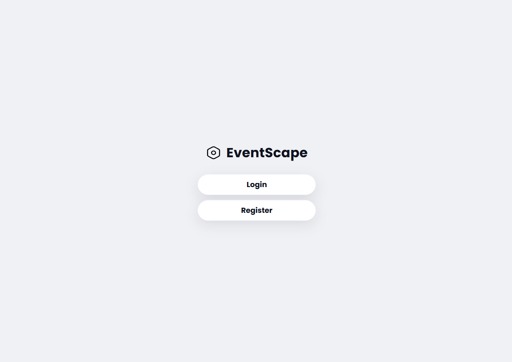
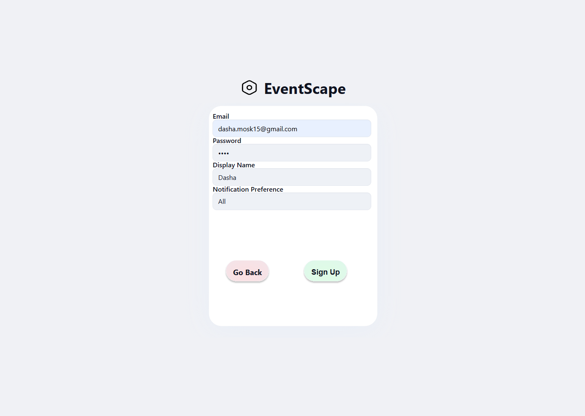
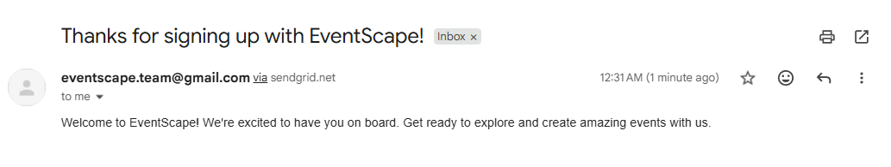
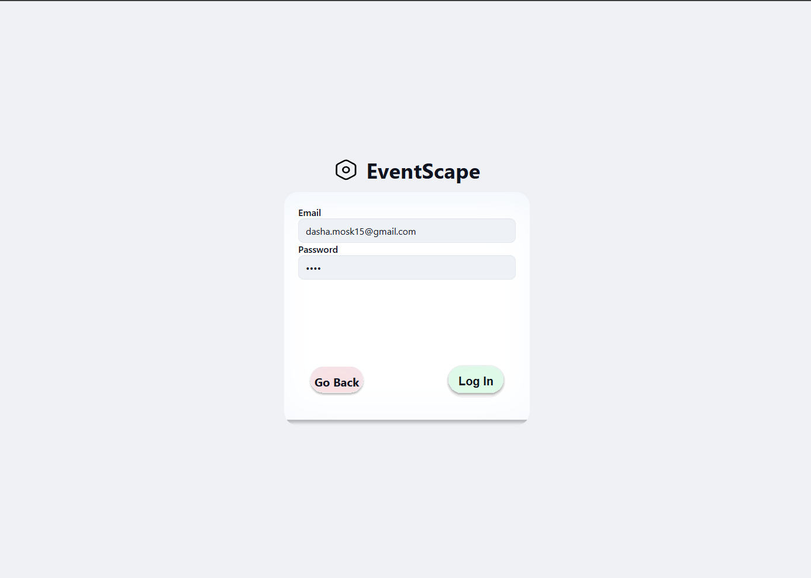
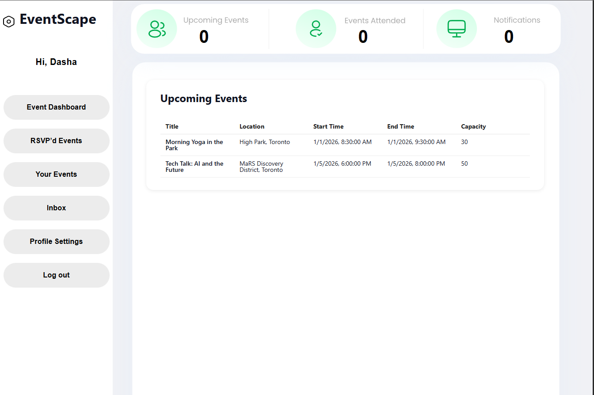
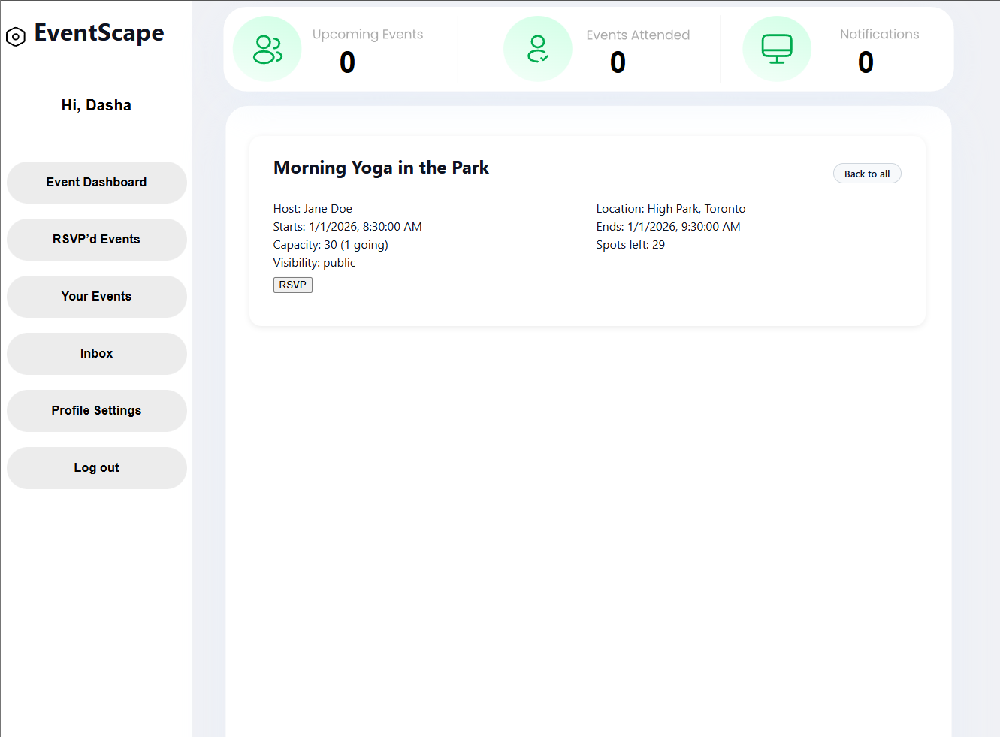
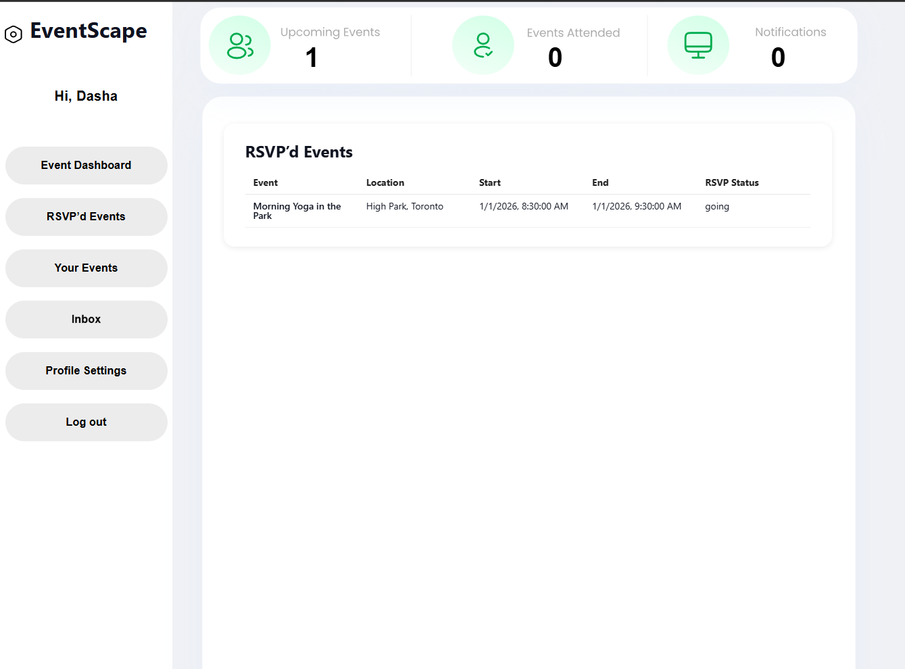
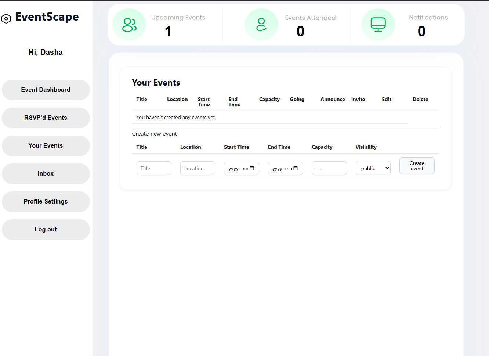
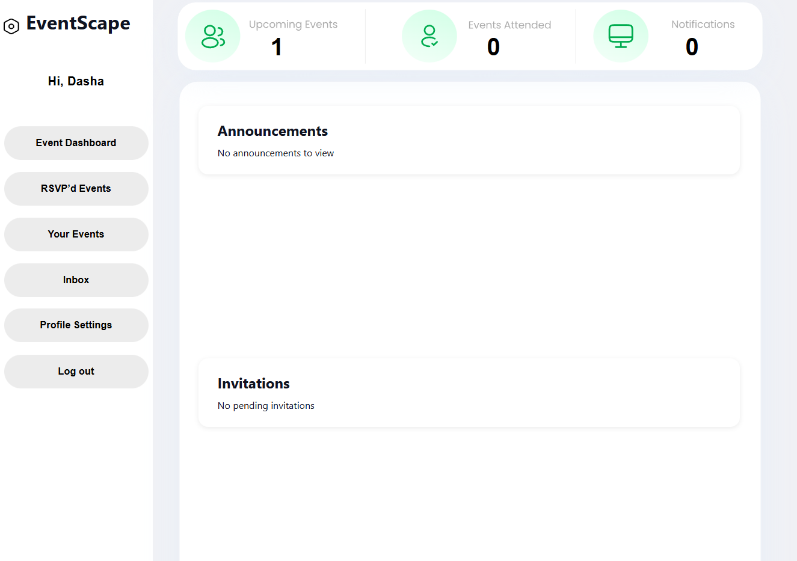
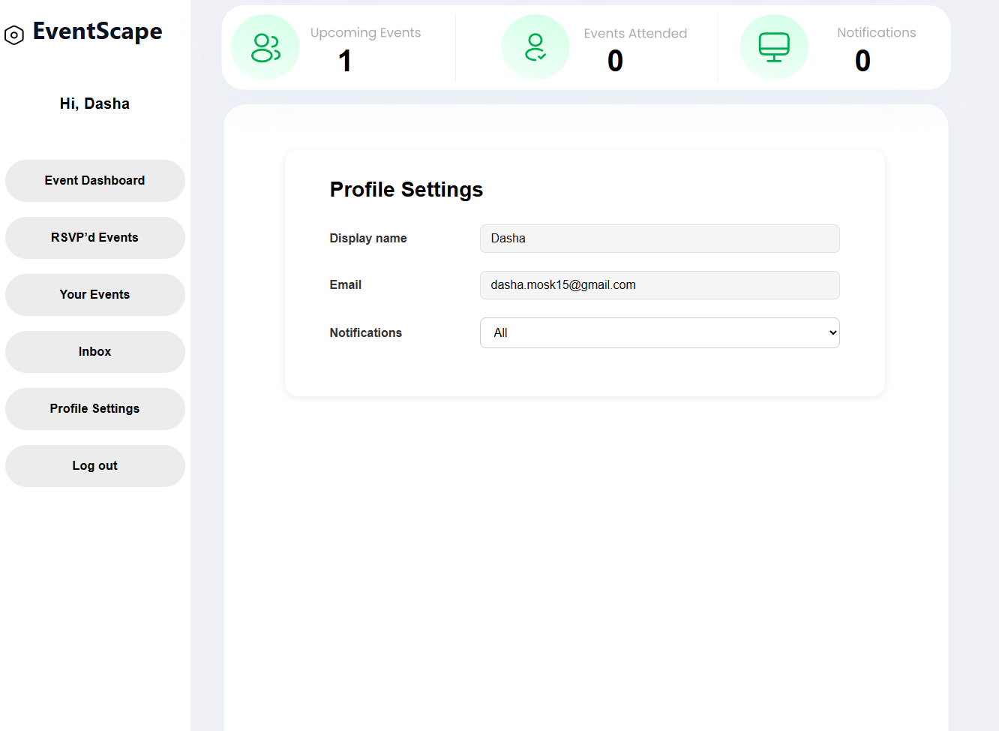

# EventScape - Final Report
### Team Information
Nilofer Hyder — 1007273807 — nilofer.hyder@mail.utoronto.ca
Jesse Na — 1005890788 — jesse.na@mail.utoronto.ca
Dasha Moskvitina — 1006055830 — daria.moskvitina@mail.utoronto.ca
Jashan Boparai — 999870858 - jashan.boparai@mail.utoronto.ca

## Motivation
In an increasingly remote world, people seek spaces to meet and socialize with others. Events, be it a small house party or a large convention, are important examples of today's social rhythm. Events bring people together; they are a time and space for us to escape from work, to learn something new, to connect with others, or to just have fun. A successful event must facilitate these interactions as smoothly as possible. While attendees enjoy the experience, organizers deal with stress, miscommunication, and coordination issues behind the scenes. Our team was motivated by this gap, and we believe that improving how organizers and attendees communicate before, during, and after events can reduce that burden.

Existing event management systems, such as Eventbrite, Eventzilla, and Ticketmaster, focus on helping hosts advertise, sell, and verify tickets. While this aspect of hosting an event is important, good event management is more than just getting people in the door. One of those missing pieces is event communication. Attendees are given static agendas via email before the event, and maybe an update at the end of the day. But what if the host wants to throw surprise mini-events or raffles to liven the atmosphere? What if an emergency comes up? Current solutions involve a megaphone, email spam, or Instagram live, and all have major drawbacks. A megaphone can’t reach distant attendees, spam emails frustrate users, and livestreams lack playback—if you miss the announcement, then you miss it.

Equally important are the many free events that are not designed to turn a profit, such as Nuit Blanche or house parties. Organizers for these events gain little benefit from using the aforementioned platforms, and still struggle with communication and coordination. This motivated us to build EventScape, a platform aimed at giving these organizers an alternative that streamlines communication and supports a better event experience for organizers and attendees alike.

## Objectives
The objective of this project was to develop an event management and RSVP system that allows organizers and attendees to create, manage, and interact with events in real time. Our focus was on improving communication and coordination, addressing limitations in existing event tools that prioritize ticketing and static schedules. The system was designed to let organizers post events, manage RSVPs, and send real-time updates to participants through a single interface. Attendees were given the ability to browse events, RSVP, and receive instant notifications about schedule changes or announcements.

## Technical Stack
The following technologies were used in the implementation of this project:
### Containerization & Orchestration
- **Docker** - To containerize the application (backend server and database)
- **Docker Compose** - Managed multi-container setup for local development
- **Kubernetes** - Orchestrated containerized services
- **DigitalOcean Kubernetes (DOKS)** - Cloud-managed Kubernetes cluster for deployment
- **Minikube** - Local Kubernetes environment for development and testing
### Backend & Application Layer
- **Node.js** - Backend server 
- **EJS** - Server-side templating for generating frontend HTML pages
- **CSS** - For customized frontend styling
- **Socket.io** - For real-time functionality
### Database & Storage
- **PostgreSQL** - Relational database for persistent application data
- **DigitalOcean Volumes** - Persistent storage attached to Kubernetes workloads
### Deployment Platform & Cloud Services
- **DigitalOcean Droplet / Infrastructure** - Cloud platform used for hosting the application
- **DigitalOcean Monitoring & Alerts** - Observability tools used to track CPU, memory, and cluster health
### Notifications
- **SendGrid** - For sending email notifications to users

## Features
This section describes the core features offered by EventScape and explains how they fulfill both the course project requirements and our project objectives.
### 1. User Authentication: Registration, Login, Profile Settings, and Logout
#### Overview
EventScape provides a user authentication flow, allowing users to create accounts, log in, modify profile settings, and log out. This supports personalized event dashboards and RSVP management.
#### Course Project Requirements Fulfilled
- **Persistent Storage**: All user information, including email, password hash, and display name, is stored in a PostgreSQL database backed by persistent volumes. This allows user data to persist across container restarts and Kubernetes redeployments.
- **Containerization and Orchestration**: User authentication is handled by the node-app Docker container, which is managed by a Kubernetes Deployment. All authentication routes are exposed through a LoadBalancer Service that distributes incoming traffic across pods. The PostgreSQL database runs in a separate Deployment and is accessed internally through a ClusterIP Service, allowing authentication data to be stored and retrieved reliably across restarts.
- **Monitoring**: Traffic is monitored through Fly.io’s built-in dashboard, which provides metrics for CPU, memory usage, and request counts. We track how many users are logged in and Kubernetes distributes traffic across multiple pods through its built-in load balancing. This ensures stable performance even when multiple users log in simultaneously.
- **Integration With External Services**: SendGrid is used to email users a welcome or confirmation message upon registration. This satisfies one of our selected advanced features by integrating a third-party service into our workflow.

#### Achieving Project Objectives
Allowing anyone to register supports EventScape’s goal of enabling broad access to event participation. A persistent user account enables personalized communication and streamlined interaction before, during, and after events.

### 2. Event Creation and Management 
#### Overview
Organizers can create, edit, and manage the events they host. The “Your Events” page displays all events created by the logged-in user, including visibility, capacity, and event times.
#### Course Project Requirements Fulfilled
- **Persistent Storage**: All event data is stored in the events table, which includes fields for event metadata, timestamps, visibility, and host ID. Persistent volumes ensure events remain intact across redeployments.
- **Containerization and Orchestration**: Event creation and management are served by the node-app deployment, with all event-related routes exposed through the LoadBalancer service for consistent access. The application retrieves and stores event details in the PostgreSQL database via the internal ClusterIP Service, ensuring event data remains reliable across pod restarts

#### Achieving Project Objectives
This feature fulfills the objective of allowing organizers to create dynamic, up-to-date events rather than depending on static schedules. It improves both flexibility and coordination for event hosts.

### 3. Event Dashboard and RSVP’d Events
#### Overview
The Event Dashboard displays all public events with start times in the present or future. Users can browse events, view details, and RSVP. A separate RSVP page allows users to see which events they are attending.

#### Course Project Requirements Fulfilled
- **Persistent Storage**: All event data is stored in the events table, and all RSVPs are stored in the rsvps table within PostgreSQL. Persistent volumes ensure that both event information and RSVP relationships remain intact across pod restarts and redeployments.
- **Containerization and Orchestration**: The Event Dashboard and RSVP routes are served by the node-app Deployment and exposed through the LoadBalancer Service. Data from the events and rsvps tables is retrieved through the PostgreSQL Deployment via its internal ClusterIP Service, ensuring reliable access even during pod restarts.
- **Achieving Project Objectives**: This feature allows attendees to easily browse and discover upcoming events. Providing an RSVP list helps users keep track of their commitments while helping organizers understand attendance beforehand.

### 4. User Dashboard and Inbox

#### Overview
The “Inbox” tab shows announcements from events the user has RSVP’d to, allowing for organizers to post updates that appear immediately to attendees.The user dashboard at the top of the application provides a quick overview of a user’s upcoming events, past attendance, and total notifications received that is updated in real-time.

#### Course Project Requirements Fulfilled

- **Real-Time Functionality**: Socket.io updates the user dashboard and inbox instantly. When organizers post announcements, notification entries are created and pushed to attendees in real time, allowing notification counts and inbox messages to refresh without a page reload. 
- **Persistent Storage**: Notifications are stored in the notifications table and linked to their associated user and event. Persistent volumes ensure this data, including inbox messages and notification counts, remains intact across pod restarts and redeployments.

#### Achieving Project Objectives
This feature directly supports EventScape’s main objective: improving communication between organizers and attendees. Users receive timely, accurate updates related to the events they care about, reducing miscommunication and improving coordination.

## User Guide

When you open EventScape, start by clicking Register, enter your information, and select Sign Up to create your account.

After registering, check the email address you provided to view our welcome message. If you do not see it in your inbox, be sure to check your spam folder.

Return to EventScape and log in using the credentials you just created. This will bring you to your personal dashboard.

Upon logging in, you will see the user dashboard at the top of the page along with a list of public upcoming events you can browse and RSVP to.

Clicking on an event opens its full details, including title, location, schedule, and capacity. From here, you can RSVP or cancel your RSVP at any time. Your dashboard updates instantly after responding.

The RSVP tab on the left-hand sidebar shows all events you have signed up for in one place

The Your Events tab allows you to create and manage events you are hosting. You can enter event details, adjust visibility, and manage capacity

The Inbox tab displays all notifications you have received. Announcements come from organizers of events you have RSVP’d to, while invitations appear when another user invites you to their event. 

The Profile Settings tab shows your display name and email, and lets you change your notification preferences.

Selecting Log Out from the sidebar returns you to the home page, where you can log in again or register a new account.

## Video Demo

## Development Guide
We've set up two ways to develop locally:
- First, using a multi-container stack via Docker Compose that contains an app container built from our Dockerfile and a databse container built from a public Postgres image. We use this method for faster development of the app itself.
- Second, using a local Kubernetes environment via Minikube that contains an app deployment running pods with containers built from our Dockerfile and a database deployment running pods with containers built from a public Postgres image. We used kustomization.yaml to reduce redundancy. We use this method primarily to test our orchestration before deploying our cluster to DigitalOcean.

Regardless of the approach, when making development changes to the app. You will need to follow the instructions to stop the project, then start the project again.

This guide assumes you are already inside the eventscape project folder.
### How to run locally using Docker Compose
- Make sure you have Docker installed
-   To start the project
    -   Create a `.env` file at the same level as the compose.yaml and inside it put your _SENDGRID_API_KEY_, desired _DB_PASSWORD_, and desired _SESSION_SECRET_. Credentials sent to TA.
    -   Run `docker compose up --build -d`
    -   Go to `http://localhost:3000`, and you can now test your changes in the app.
-   To stop the project
    -   Run `docker compose down`
        -   Pass the `--volumes` flag only if you want to erase the persistent database (i.e. you made a change to the database schema)

### How to run locally using Minikube
- Make sure you have Docker, Minikube, and the kubectl command-line tool installed
-   To start the project
    -   In one terminal
        -   `minikube start` if not already started
        -   `docker build -t eventscape-app:1.0 .`
        -   `minikube image load eventscape-app:1.0`
        -   Inside the `base` folder you will also need to create your own `.env.secret` file. Credentials sent to TA
            -   The following keys are required: _SENDGRID_API_KEY_, _SESSION_SECRET_, and _DB_PASSWORD_
        -   `kubectl apply -k overlays/dev`
        -   `kubectl get pods`
            -   Wait till both pods are 1/1
        -   `minikube tunnel`
    -   In a second terminal
        -   `kubectl get services`
            -   Copy IP address and paste into browser (e.g. http://127.0.0.1:3000 or http://localhost:3000), and you can now test your changes in the app.
            -   Note this ip address will not change, so you only need to do this the first time
-   To stop the project, in your first terminal
    -   Stop the minikube tunnel process
    -   `kubectl delete -k overlays/dev`
    -   `minikube stop` if you are done developing for the day; if you are just making a change to the app, then skip this step
    -   `minikube delete` only if you want to erase the persistent database (i.e. you made a change to the database schema)

## Deployment Information
Our Kubernetes cluster is deployed on DigitalOcean at http://209.38.12.238/

### How to deploy to DigitalOcean

-   Sign in with `doctl` and switch to the appropriate DigitalOcean context
    -   See the [documentation](https://docs.digitalocean.com/reference/doctl/how-to/install/) for help.
-   Switch kubectl context to Kubernetes cluster on DigitalOcean `doctl kubernetes cluster kubeconfig save 2de56168-f09f-4af5-8163-ada2a7aa310a`
-   Verify you are connected by running `kubectl cluster-info`. You should see the control plane is running on a DigitalOcean domain.
-   Build the docker image `docker buildx build --platform linux/amd64 -t eventscape-app:amd64 .`
-   Tag and push image `docker tag eventscape-app:amd64 sodiumna11/eventscape-app` and `docker push sodiumna11/eventscape-app`
    -   To use your own Docker account, replace `sodiumna11` with your username and update `overlays/prod/app-deployment.yaml` accordingly.
-   Deploy the cluster to DigitalOcean `kubectl apply -k overlays/prod`
    -   Again, ensure you have `.env.secret` file inside the `base` folder.
-   Wait until all pods are ready `kubectl get pods`
-   Run `kubectl get services` to find out the external IP of the node-app. Copy the IP and paste it into a browser
-   To remove the current deployment, run `kubectl delete -k overlays/prod`

#### Rolling updates

-   To apply an update to the Kubernetes deployment, simply deploy the cluster again using `kubectl apply -k overlays/prod`
-   To apply a Docker image (aka an app) update
    -   Start by building the docker image again `docker buildx build --platform linux/amd64 -t eventscape-app:amd64 .`
    -   Then tag and push the image `docker tag eventscape-app:amd64 sodiumna11/eventscape-app` and `docker push sodiumna11/eventscape-app`
    -   Then run `kubectl rollout restart deployment/node-app`
    -   Wait until the new pods are ready `kubectl get pods`

#### Deploy digital monitoring agent

-   Follow this [guide](https://docs.digitalocean.com/products/kubernetes/how-to/monitor-advanced/) to deploy the DigitalOcean advanced metrics agent
-   Run the following to deploy the Kubernetes metrics API `kubectl apply -f https://github.com/kubernetes-sigs/metrics-server/releases/latest/download/components.yaml`

#### Testing the deployment
-   To test monitoring alerts and the deployment's performance, install k6 and do `k6 run tests/script.js`
    -   Update the file with the correct ip and user credentials

## Individual Contributions
## Lessons Learned and Concluding Remarks
